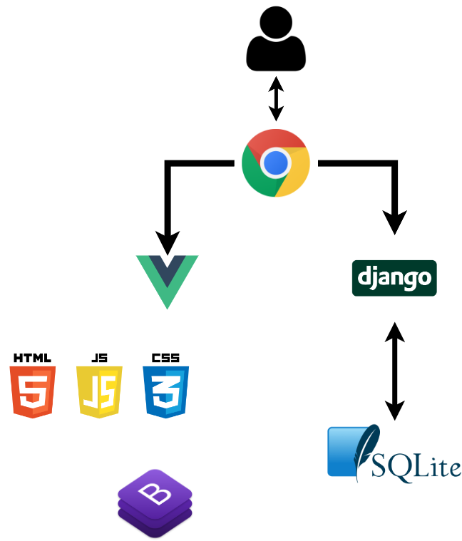

> ## :alarm_clock: 개발기간

2023.11.16(목) ~ 2023.11.24(금)

> ## 🤝 팀원

| 이름   | 담당 영역                                                    |
| ------ | ------------------------------------------------------------ |
| 김동영 | ERD , 메인페이지, 회원 커스터 마이징, 환율 계산기, 근처 은행 검색, 커뮤니티, 프로필 페이지, CSS |
| 이장하 | 예적금 금리 비교, 금융 상품 추천 알고리즘, README            |

> ## :page_facing_up: 요약

금융 지식이 부족한 유저도 쉽게 사용할 수 있는 간편한 애플리케이션 제작

> ## :dart: 목표

- 금융상품 데이터 기반 예금 및 적금 금리 비교 서비스 구성
- 금융 상품 추천 알고리즘 구성
- 환율 정보 API를 활용한 환율 계산 서비스 구성
- 지도 API를 활용한 은행 검색 서비스 구성
- 커뮤니티 서비스 구성
- 서비스 관리 및 유지보수 목표

> ## :pencil2: 계획

|                    | Front-End                                                    | Back-End                                                     |
| ------------------ | ------------------------------------------------------------ | ------------------------------------------------------------ |
| 메인 페이지        | 레이아웃 및 디자인                                           |                                                              |
| 예적금 금리 비교   | axios 활용하여 금융 상품 정보 받아오기  상품 상세 정보 화면 구현  관심상품 등록 기능 구현 | API를 이용한 금융 상품 정보 DB 저장  관심 상품 좋아요 기능 |
| 환율 계산기        | axios를 활용하여 보내 환율 정보 받아오기  환율 계산기 기능 구현 | API를 이용한 환율 정보 받아서 front로 넘기기                 |
| 지도               | API를 활용하여 Kakao 맵 화면 구현  키워드에 맞는 검색 결과 구현 |                                                              |
| 상품 추천 알고리즘 | 유저 금융 정보를 Back-End로 전송                             | K-means 클러스터링 알고리즘을 사용한 개인 맞춤 상품 추천 알고리즘 구현 |
| 게시판             | 게시글 작성 및 수정 삭제 댓글 작성 및 삭제 구현         | DB에 게시글 및 댓글 정보 저장                                |
| 회원 커스터 마이징 | 회원가입 및 유저 정보 입력 페이지 유저 금융 정보 입력   | 회원가입 Serializer 수정 및 유저 정보 DB 저장           |
| 프로필             | 개인 상세 프로필 및 관심 상품 알고리즘 추천 상품        | 상품 추천 알고리즘을 통한 추천 상품과 개인별 상세 정보 DB에서 넘겨줌 |
| 금융 상식          | axios를 통해 네이버 뉴스와 금융 상식에 대한 정보 작성   | 네이버 API를 이용해 뉴스를  front로 넘김                |

> ## :white_check_mark: 필수 요구사항

1. 메인페이지
2. 회원 커스터마이징
   - 필수 필드 : 유저이름, 이메일, 가입한 상품 목록
3. 예적금 금리 비교 - 데이터 저장
   - 데이터 DB에 저장, 이미 존재하는 데이터는 새로 저장하지 않도록 구성
4. 환율 계산기
   - 국가 선택 기능
5. 근처 은행 검색
   - 위치와 은행을 선택할 수 있도록
6. 커뮤니티(게시판)
   - CRUD 필수
7. 프로필 페이지
   - 금융 상품 추천 알고리즘
8. README
   1. 팀원 정보 및 업무 분담 내역 
   2. 설계 내용(아키텍처 등) 및 실제 구현 정도
   3. 데이터베이스 모델링(ERD)
   4. 금융 상품 추천 알고리즘에 대한 기술적 설명
   5. 서비스 대표 기능들에 대한 설명
   6. 기타(느낀 점, 후기 등)

> ## :page_with_curl: 기능목록
> 
- 메인 페이지
- 예적금 금리 비교
- 환율 계산기
- 근처 은행 찾기
- 금융 상식
- 게시판
- 프로필

> ## :books: 기술스택

<h1>📚 STACKS</h1>

    
    
     
	
    
    
     
    
    
    
     
    
    
    
     
    
    
      

> ## :link: API

   
        
          
    

> ## :black_circle: 아키텍쳐

> ## :white_circle: 데이터베이스 모델링(ERD)

> ## :red_circle: 컴포넌트 구조

> ## :closed_book: 개발일지

> ## :soccer: 금융 상품 추천 알고리즘
### 주어진 데이터 공간에서 데이터 포인트의 유사성을 찾아 그룹화하는 K-Means Clustering
- 개념 : 많은 유저들의 나이, 성별, 소득, 자산, 가입한 금융상품 목록들을 통해 나와 유사한 사람들이 가입한 금융상품을 추천
- 사용 데이터
  - Kaggle에서 나이, 성별, 재산, 금융상품 가입 여부 등이 포함된 데이터를 받음
  - 위 데이터에서 필요한 필드만 추출한뒤 연봉을 랜덤으로 입력하고, 금융상품을 가입한 사람들에게 API를 통해 받아온 금융 상풀들을 랜덤하게 입력
  - 나이, 성별, 재산, 연봉을 기준으로 4개의 그룹으로 그룹화 한뒤 상품을 추천
- 사용 기법
  - PCA기법을 사용하여 target을 분류할 때 몇개의 변수로 분류할 수 있는지 결정
  -  K-means 클러스터링 k 결정
    - Elbow Method : 각 데이터들의 군집 중심과의 평균 거리, 학습 시간을 지표로 k 값을 계산해 줍니다.

> ## :memo: 프로젝트 후기
- 김동영 : 프로젝트를 통해 게시판, 회원 기능, 그리고 API를 활용한 페이지 구성에 참여하며 많은 것을 배우고 느낄 수 있었습니다. 팀원과의 협업을 통해 전반적인 프로젝트 구조를 이해하고 기능을 구현하는 경험을 쌓을 수 있었습니다. 아직 부족한 부분이 많다고 느꼈지만, 이를 극복하기 위해 더 열심히 공부하고 개발 실력을 향상시키는 노력을 기울이겠습니다. 2학기에는 더 나은 결과물을 위해 더 많은 기술적 도전에 도전하고 성장하도록 하겠습니다.
- 이장하 : 약 일주일의 짧은 시간동안 지금까지 배웠던 내용들을 바탕으로 진행한 첫 프로젝트였습니다. 프로젝트 경험이 거의 없어 첫 설계부터 어려움이 있었습니다. 일단 기본적인 틀을 잡아두고 진행하면서 조금씩 채워나가자는 방식으로 기획을 하였는데, 방향성을 잘 정해서 돌아가는 일이 많지 않아 다행이었습니다. 완벽하지는 않지만 처음 기획한 기능들을 다 구현하고, 추가 기능을 같이 고민하고 구현해볼 수 있는 시간이 되어서 뜻깊었습니다. 끝나고 보니 디자인이 정말 어려운 부분이라는 것을 깨달았습니다. 기능에만 초점을 맞추고 디자인을 소홀히 하였는데 다음 프로젝트부터는 신경써야겠다는 반성도 하였습니다. 짧은 기간동안 여러 어려움도 있었지만 프로젝트를 완성하여서 뿌듯하고 이번 프로젝트를 복기하고 열심히 공부하면 더 나아갈 수 있다고 생각합니다.

> ## :rainbow: 참고페이지
[GPT](https://chat.openai.com/)
[마이뱅크](https://www.mibank.me/)
[뱅크샐러드](https://www.banksalad.com/)
[bootstrapDoc](https://getbootstrap.com/)
[Kaggle](https://www.kaggle.com/)
